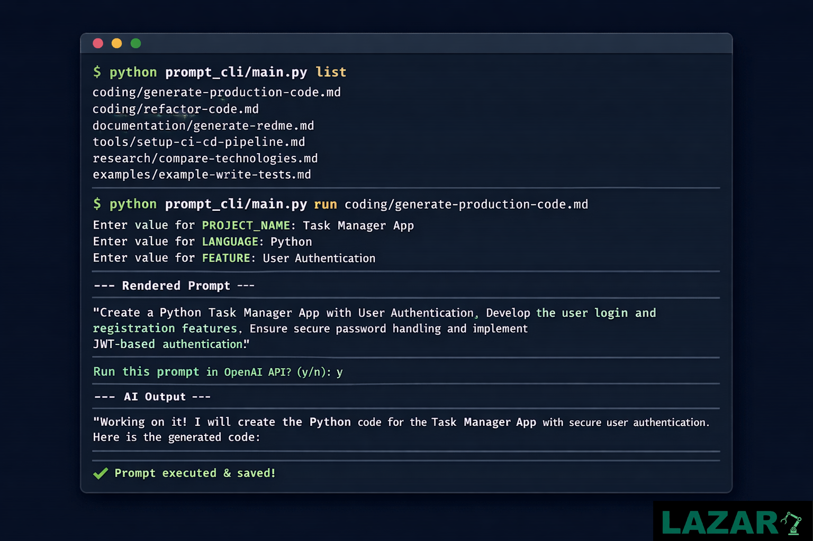

# 🚀 AI Prompt Library for Developers


> A production-ready AI Prompt Toolkit for developers — coding, DevOps, documentation, research & automation.

[](LICENSE)
[](CONTRIBUTING.md)
[]()
[]()

---

## 📌 What Is This?

**AI Prompt Library for Developers** is a structured collection of high-performance prompts designed to:

- 👨‍💻 Generate production-ready code  
- 🛠 Automate DevOps and CI/CD workflows  
- 📄 Create documentation, wikis, and changelogs  
- 🔬 Conduct technical research & comparisons  
- 🧪 Provide real-world examples for prompt engineering  

All prompts are structured for **clarity, repeatability, and scalability**.

---

## ⚡ Quick Start

1. Clone the repo:
   ```bash
    git clone https://github.com/Lazaro549/AI-Prompt-Library-for-Developers.git

2. Install Python dependencies (for CLI):
   ```bash
   cd prompt_cli
   pip install -r requirements.txt
3. Set your OpenAI API key in .env
   ```ini
   OPENAI_API_KEY=your_api_key_here
4. List prompts:
   ```bash
   python main.py list
5. Run a prompt:
   ```bash
   python main.py run coding/generate-production-code.md
- Fill in placeholders

- Confirm execution

- Output saved automatically in `results/`

## 💸 Donations

If you'd like to support this project:

- 🇦🇷 ARS (Argentina)  
  Alias: `lazaro.503.alaba.mp`

- 🌎 USD (Argentina only, local transfers)  
  Alias: `ahogada.duras.foca`
